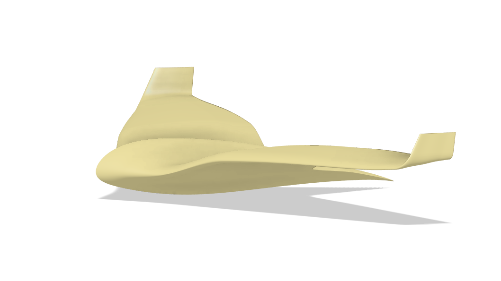
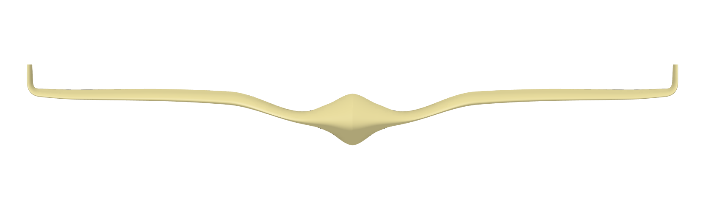
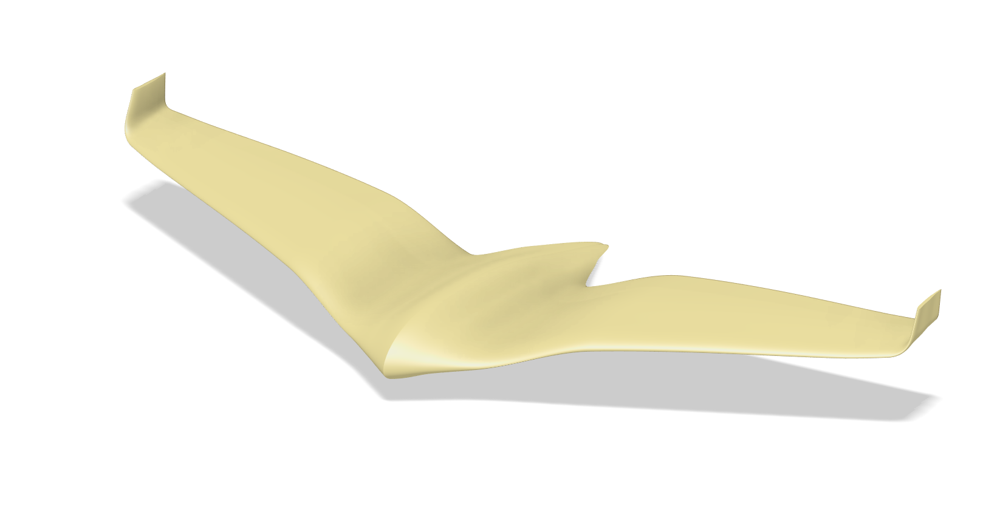
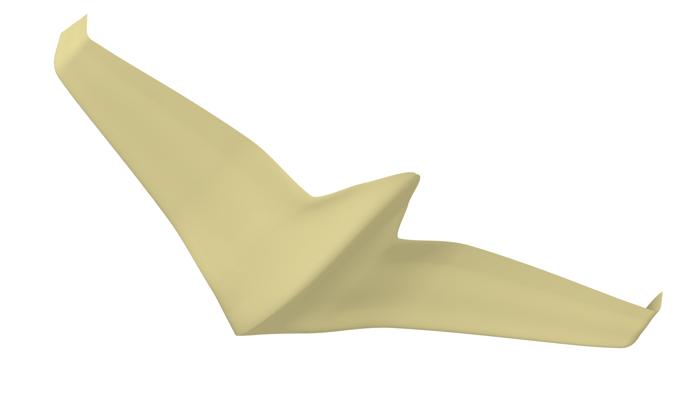
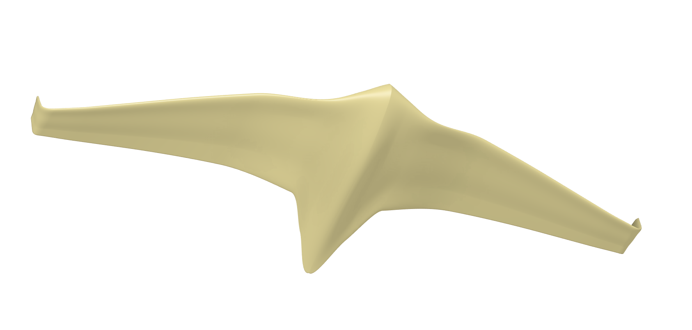

# MANTA — Surrogate-Assisted MDO for Blended Wing Body UAVs

Multidisciplinary Design Optimization pipeline for a jet-powered Blended Wing Body (BWB) flying wing with integrated EDF propulsion. From parametric geometry to manufacturable Pareto-optimal designs.

<p align="center">
  
</p>

<p align="center">
  
</p>

<p align="center">
  
  
  
</p>

---

## Highlights

- **End-to-end pipeline**: 9 Jupyter notebooks from mission definition to composite layup planning
- **32 design variables** | 19,500 LHS samples | 20 surrogate targets | 5-network PyTorch ensemble
- **Physics-based aero**: AVL (3D Vortex Lattice) + NeuralFoil (viscous drag)
- **Multi-objective**: NSGA-II (pymoo) optimizing L/D, structural mass, and endurance under 12 constraints
- **Manufacturable**: 9-factor scoring, composite layup planning, STL/CSV CAD export
- **Integrated propulsion**: S-duct sizing (Seddon & Goldsmith), EDF thrust/drag balance

---

## Pipeline Overview

```
NB  Stage                        Description
──  ─────────────────────────    ─────────────────────────────────────────
01  Mission & Mass Budget        2.5 kg MTOW, 70 mm EDF, 20-component avionics BOM
02  Parametric Geometry          32-variable BWB (Kulfan CST airfoils, AeroSandbox)
03  Dataset Generation           19,500 LHS samples evaluated (AVL + NeuralFoil)
04  Surrogate Training           5-network PyTorch ensemble → 20 targets
05  Multi-Objective Optim.       NSGA-II: L/D vs mass vs endurance (12 constraints)
06  Design Catalog               Pareto front analysis + manufacturability ranking
07  Validation                   Full AVL re-evaluation of selected designs
08  Propulsion Integration       S-duct geometry, clearance check, STL export
09  Manufacturing                Composite layup plan, materials BOM
```

---

## Installation

```bash
git clone https://github.com/data-fablab/MANTA.git
cd MANTA
python -m venv .venv
# Windows
.venv\Scripts\activate
# Linux / macOS
source .venv/bin/activate

pip install -r requirements.txt
```

### AVL (Athena Vortex Lattice)

Aerodynamic evaluation (notebooks 03 and 07) requires [AVL](https://web.mit.edu/drela/Public/web/avl/) on your PATH.
The expected command name is `avl` — verify with:

```bash
avl
```

If AVL is installed elsewhere, edit `config/default.yaml` → `avl.command`.

---

## Usage

Run notebooks sequentially from `01` to `09`. Each notebook is self-contained and documents its inputs/outputs.

```bash
jupyter lab notebooks/
```

Regenerable artifacts (datasets, trained models, figures) are excluded from the repository. Notebooks `03` and `04` regenerate `data/` and `models/` respectively; all notebooks produce figures in `output/`.

---

## Design Space

### 32 Design Variables (8 groups)

| Group | Variables | Range |
|-------|-----------|-------|
| **Planform** (4) | half_span, root_chord, taper_ratio, LE_sweep | 0.55–1.0 m, 0.25–0.55 m, 0.08–0.40, 18–35 deg |
| **Center-body BWB** (10) | body_chord_ratio, body_halfwidth, 6 Kulfan weights, body_twist, body_sweep_delta | CST parameterization |
| **Outer wing twist** (5) | 5 spanwise stations root-to-tip | -8 to +1 deg |
| **Outer wing dihedral** (5) | gull + winglet segments | 5–30 deg gull, 0–90 deg winglet |
| **Kulfan CST airfoil** (8) | 6 root weights + 2 tip delta-offsets | Airfoil shape |

### 20 Surrogate Targets

Aerodynamic (CL_0, CL_alpha, CM_0, CM_alpha, CD0_wing, CD0_body, CD, L/D), stability (Cn_beta, Cl_beta, static_margin), control (CL_de, Cm_de, elevon_deflection), geometry (struct_mass, internal_volume, x_cg_frac, Vs), and manufacturability.

### 12 Feasibility Constraints

| Constraint | Bound | Rationale |
|------------|-------|-----------|
| Static margin | -0.05 to 0.55 MAC | Longitudinal stability |
| T/D ratio | >= 1.0 | Thrust covers drag |
| Endurance | >= 300 s | 5-min minimum |
| Stall speed | <= 15 m/s | Safe landing |
| Elevon deflection | <= 20 deg | Servo range |
| Servo torque | <= 1.3 kgcm | Emax ES3004 |
| Manufacturability | >= 0.20 | Buildable |
| Aspect ratio | >= 4.0 | Efficiency |
| Dutch roll damping | > 0 | Lateral stability |

---

## Surrogate Architecture

```
Design vector (32 vars)
        │
  Feature engineering (52 augmented features: nonlinear scaling, cross-terms)
        │
  ┌─────┼─────┬─────┬─────┐
  MLP1  MLP2  MLP3  MLP4  MLP5    (independent training)
  └─────┼─────┴─────┴─────┘
        │
  Ensemble mean → 20 targets
```

Each MLP: `52 → [256, 128, 64] → 20` with SiLU + BatchNorm + Dropout(0.05).

Trained on 19,500 LHS samples evaluated with AVL + NeuralFoil.

---

## Mission Specifications

| Parameter | Value |
|-----------|-------|
| MTOW | 2.5 kg |
| Cruise speed | 25 m/s (90 km/h) |
| Altitude | 100 m AGL |
| EDF | 70 mm Schubeler DS-51 class (10 N static thrust) |
| Battery | 3S LiPo 1800 mAh (11.1 V, 130 Wh/kg) |
| Payload | 200 g (GoPro + 2-axis gimbal) |
| Airframe budget | ~1.65 kg |

---

## Project Structure

```
MANTA/
├── config/
│   └── default.yaml           All pipeline parameters
├── img/                       Illustrations
├── notebooks/                 9 sequential Jupyter notebooks (01–09)
├── src/
│   ├── aero/                  AVL runner, NeuralFoil drag, stability, evaluator
│   ├── evaluation/            9-factor manufacturability scoring
│   ├── geometry/              Control surface geometry, boolean tools
│   ├── manufacturing/         Composite layup planning, materials database
│   ├── optimization/          NSGA-II problem, design catalog, evaluation database
│   ├── parameterization/      32-variable BWB geometry (Kulfan CST, AeroSandbox)
│   ├── propulsion/            EDF model, S-duct sizing (physics-based), thrust balance
│   ├── surrogate/             PyTorch ensemble MLP, feature engineering, reconstruction
│   ├── systems/               CG computation, 20-component avionics BOM
│   ├── visualization/         STL export, comparison plots, style
│   ├── config.py              YAML configuration loader
│   └── constants.py           Physical constants
├── data/                      Dataset + evaluation database (gitignored, regenerable)
├── models/                    Trained surrogate weights (gitignored, regenerable)
├── output/                    STL, PNG, CSV exports (gitignored, regenerable)
├── requirements.txt
└── LICENSE
```

---

## Tech Stack

| Layer | Tools |
|-------|-------|
| Aerodynamics | AVL (3D VLM), NeuralFoil (neural viscous drag) |
| Geometry | AeroSandbox, Kulfan CST parameterization |
| ML Surrogate | PyTorch (ensemble MLP, feature engineering) |
| Optimization | pymoo (NSGA-II multi-objective) |
| Scientific | NumPy, SciPy, Pandas, scikit-learn |
| CAD Export | numpy-stl, Matplotlib |
| Config | PyYAML |

---

## Key Design Decisions

- **Ensemble over single network**: 5 independent MLPs reduce surrogate prediction variance and improve Pareto front reliability
- **Feature engineering**: 32 raw variables augmented to 52 features (interaction terms, nonlinear transforms) for better surrogate accuracy
- **Dual AVL passes**: Untrimmed (alpha=0) + trimmed (with elevon) captures coupled aero-control effects
- **Physics-based duct**: S-duct geometry from Seddon & Goldsmith aerodynamics, not fitted curves
- **Parallel evaluation**: ProcessPoolExecutor with up to 8 workers for dataset generation

---

## License

[MIT](LICENSE)
